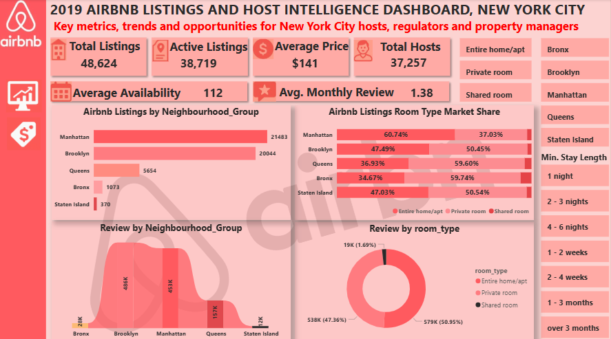

# Airbnb-Listings-Analysis-In-New-York-City

Airbnb stakeholders needed to know where to invest, which hosts to support, and how room/host types actually perform across NYC - not from anecdote, but from the listings data itself. I cleaned and validated the public NYC listings dataset in SQL Server, built categorized views, and visualized the results in Power BI. The headline: Tribeca, Harlem, Williamsburg, and Midtown Manhattan offer the best ROI, commercial hosts dominate high-value zones, and the best onboarding targets are part-time hosts averaging 112 available days a year in under-served outer boroughs.

### The Business Problem

Airbnb investors and platform operators face three recurring questions with no data-backed answer: where should new investment go, which host/room types actually perform, and which hosts should be prioritized for onboarding support. Without this, investment and growth decisions default to guesswork.

### Data & Method

* Tools: SQL Server Management Studio (cleaning, transformation, querying), Power BI (visualization)
* Cleaning: validated lat/long to NYC bounds (40.5 – 40.9 / -74.25 – -73.7), removed listings with minimum_nights > 365, flagged $0-priced listings, excluded neighborhoods with fewer than 10 listings, created a cleaned_listings view via ALTER VIEW
* Categorization: grouped minimum_nights into stay-duration bands using CASE statements; segmented hosts by activity level (full-time vs. part-time)
* Analysis: identified high-earning neighborhoods, compared price/availability by room and host type, reviewed engagement trends by borough

[Sales Analysis SQL](sql_queries/nyc_airbnb_project.sql)

### Key Insights

* "Tribeca, Harlem, Williamsburg, and Midtown Manhattan deliver the best investment ROI" - through a mix of high demand and premium pricing.
* "Commercial hosts dominate the highest-value zones, while entire-home listings outperform specifically in Manhattan" - room type performance is borough-dependent, not universal.
* "Shared and private rooms outperform in budget boroughs" - the winning strategy flips outside Manhattan.
* "Part-time hosts average 112 available days a year - the strongest untapped onboarding segment" - a specific, actionable target for growth teams.
* "Outer boroughs show strong engagement but lower competition" - an under-served growth opportunity distinct from the premium-zone story.

### Clear Recommendations

* Direct new investment toward Tribeca, Harlem, Williamsburg, and Midtown Manhattan first.
* Push entire-home inventory in Manhattan; push shared/private-room inventory in budget boroughs.
* Build a targeted onboarding campaign for part-time hosts, using top-reviewed listings as a coaching template.
* Prioritize outer-borough host recruitment where engagement is strong, but supply is thin.

Links: [Live dashboard](https://app.powerbi.com/view?r=eyJrIjoiZDYzZjY5NWQtMmE3NS00NjAxLTlkZTgtMWRkOTA5YTkzZDg2IiwidCI6ImI2NDU3ZDY4LTQzODgtNGMzYS04MjIyLTc0ZGU0NDU5ZDFlZiJ9) · [Medium write-up](https://medium.com/@ajagunalliyu/airbnb-listings-analysis-in-new-york-city-with-sql-11beb1f8b615)

## Let's Connect
 
> Feel free to reach out: [ajagunalliyu@gmail.com](mailto:ajagunalliyu@gmail.com)  
> Connect with me on [LinkedIn](https://www.linkedin.com/in/alliyuajagun)  
> Follow on [Twitter/X](https://x.com/Sayyid_Alliyu)  
> Read more on [Medium](https://medium.com/@ajagunalliyu)  
> 💻 Explore more projects on [GitHub](https://github.com/ajagunalliyu)
> View [Portfolio website](https://sites.google.com/view/alliyutheanalyst/portfolio?authuser=0)

## ⭐ Support

If you found this project helpful or interesting, consider giving the repository a **star**. Your support helps increase the visibility of my work and encourages me to continue building and sharing data analytics projects.

Thank you for visiting!

